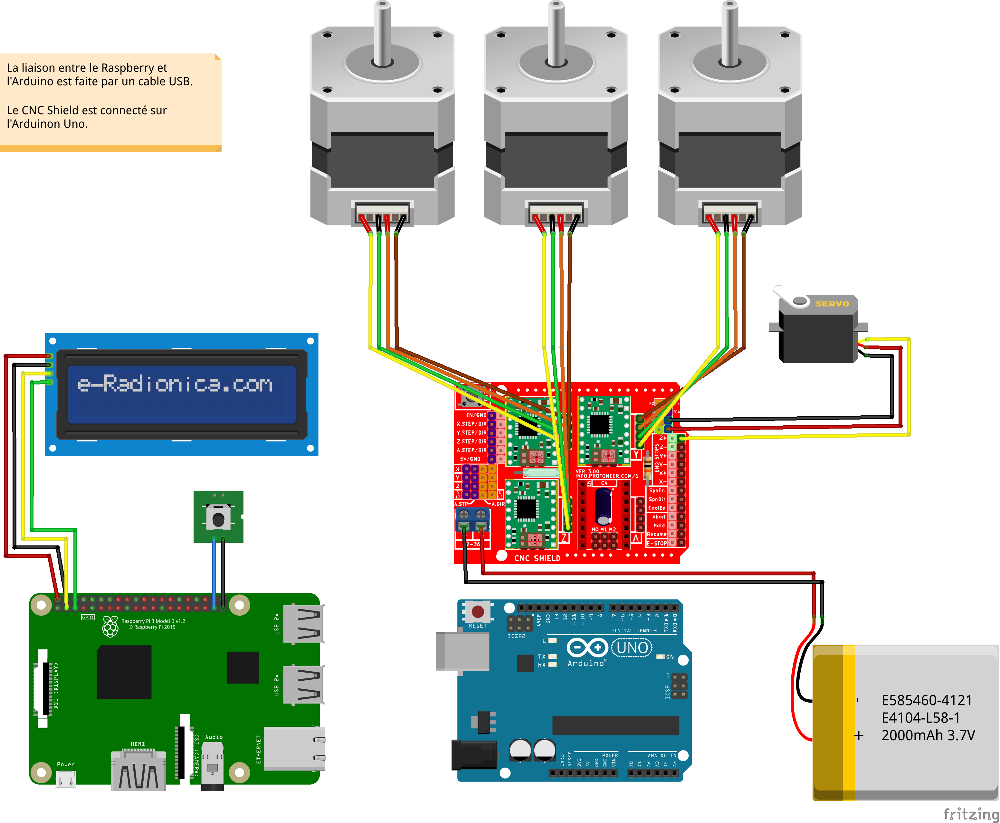

# Introduction

Le C2i Robot est le projet du groupe Robot de l'association C-2i. L'objectif générale est de réaliser un appareil mobile, autonome dans son environnement et capable d'y réaliser des opérations (prendre des objets, détecter des obstacles, passer l'aspirateur, ...).

Notre première étape vers cet objectif est fabriquer un bras robotisé munis d'une pince. Nous avons d'abord conçu un prototype en utilisant des servomoteurs. Nous avons acquis de l'expérience sur les articulations et la motorisation. Les servomoteurs étant peu puissant et la géométrie de notre prototype n'étant pas irréprochable, notre bras prototype ne fonctionnait pas correctement. [inspiration](https://www.youtube.com/watch?v=bYcbU8aQ2Js)

Nous avons donc décidé d'utiliser un modèle de bras existant pour nous éviter les écueils du départ et progresser plus rapidement sur les autres aspects : l'automatisation et l'intégration à l’environnement. Nous avons choisit le projet suivant : [https://www.thingiverse.com/thing:2520572].

Le projet utilise un Raspberry PI pour piloter l'ensemble en envoyant les instructions à un Arduino. L'Arduino fait tourner grbl, un interpréteur de g-code, qui pilote les moteurs pas à pas du bras et le servomoteur de la pince.

# Modèles 3D

Les modèles sont stockés [ici](../design-3d/files/).
Les fichiers "stl" sont passé dans Cura pour produire le g-code utilisé par l'imprimante 3D.

# Nomenclature

| Composant | Référence | Nombre | Description |
| --------- | --------- | ------ | ----------- |
| Raspberry PI | v3B+ | 1 | [https://www.gotronic.fr/art-carte-raspberry-pi-3-b-27826.htm] |
| Carte SD |  | 1 |  |
| Écran LCD I2C | 16x2 | 1 | [https://www.gotronic.fr/art-afficheur-lcd-2x16-i2c-ld1602i2c-25386.htm] |
| Bouton poussoir |  | 1 |  |
| Arduino Uno | Rev3 | 1 | [https://www.gotronic.fr/art-carte-arduino-uno-12420.htm] |
| CNC Shield | Shield CNC pour Uno ARD-CNC-K1 | 1 | [https://www.gotronic.fr/art-shield-cnc-pour-uno-ard-cnc-k1-27753.htm#complte_desc] |
| Controleur moteur pas à pas | drivers A4988 | 3 | vendu avec le CNC shield |
| Moteur pas à pas | 17HM15-0904S | 3 | [https://www.gotronic.fr/pj-1319.pdf]   Nombre de pas: 400   Angle par pas: 0,9°   Alimentation: 5,4 V   Résistance/phase: 6 ohms   Courant/phase: 0,9 A   Inductance/phase: 12 mH   Couple de maintien: 3,6 kg.cm   (Holding torque en anglais)   Connexion: 4 fils   Dimensions de l'axe: Ø5 x 20 mm   Dimensions: 42 x 42 x 42 mm   Poids: 280 g  |
| Servomoteur | SG90 | 1 | [https://www.gotronic.fr/art-servomoteur-sg90-19377.htm] |

# Matériel

## Schéma de câblage

## Arduino

### Principe

La carte Arduino est une carte électronique simple qui n’est pas un ordinateur. Elle consomme peu d’énergie et a un faible coût. On doit y installer un programme pour lui donner des instructions à réaliser.

Notre projet est basé sur l'assemblage d'un Arduino et d'une carte regroupant plusieurs contrôleurs pour commander les moteurs. Ces composants sont en général utilisés pour fabriquer des machines à commandes numérique (aussi appelé CNC). Ces machines sont standardisées et utilisent un langage spécifique le "g-code". Il s'agit du même type de code que celui utilisé par les imprimantes 3D.

Pour remplir cette fonction, l'Arduino doit contenir un programme qui doit recevoir et interpréter le g-code et envoyer les instructions vers les moteurs. Ce programme s'appelle : "grbl".

### grbl

Afin de piloter le servomoteur actionnant la pince, il faut utiliser une version spécifique de grbl : grbl-servo (https://github.com/stimulee/grbl-servo).

#### installation

Via le logiciel Arduino, cliquez sur Croquis puis Inclure une bibliothèque et Ajouter la bibliothèque .ZIP. Sélectionnez le dossier grbl situé dans le dossier grbl-servo.

Pour implémenter GRBL sur l’Arduino, il suffit d’aller dans Fichier > Exemples > grbl > grbl-upload

Enfin, téléversez ce script dans l’Arduino.

On peut configurer GRBL afin qu’il s’adapte aux réglages de notre CNC grâce au moniteur série. Pour cela, ouvrez le moniteur série (Outils > Moniteur série).

Réglez la vitesse à 115200 baud et sélectionnez nouvelle ligne. En tapant $$ vous verrez apparaître la configuration de GRBL.

Tous les détails sont disponible ici : [https://letmeknow.fr/blog/2016/07/11/piloter-une-cnc-avec-arduino-et-grbl/]

Une fois grbl installé sur Arduino, le programme est exécuté dès le démarrage de l'appareil.

Pour tester le bon fonctionnement, il faut brancher l'Arduino au port USB du Raspberry PI. Une fois connecter sur le Raspberry, ouvrir un terminal.

Installer la commande "screen" :

    sudo apt install screen

Établir une communication pour envoyer des commandes g-code à grbl :

    screen /dev/ttyACM0 115200

Exemple de commande :

    $$ (view Grbl settings)
    $# (view # parameters)
    $G (view parser state)
    $I (view build info)
    $N (view startup blocks)
    $x=value (save Grbl setting)
    $Nx=line (save startup block)
    $C (check gcode mode)
    $X (kill alarm lock)
    $H (run homing cycle)
    ~ (cycle start)
    ! (feed hold)
    ? (current status)
    ctrl-x (reset Grbl)

#### Configuration

[https://lebearcnc.com/configurer-et-parametrer-grbl/]

Exemple de configuration (commande $$):

    $0=10 (step pulse, usec)
    $1=25 (step idle delay, msec)
    $2=0 (step port invert mask:00000000)
    $3=6 (dir port invert mask:00000110)
    $4=0 (step enable invert, bool)
    $5=0 (limit pins invert, bool)
    $6=0 (probe pin invert, bool)
    $10=3 (status report mask:00000011)
    $11=0.020 (junction deviation, mm)
    $12=0.002 (arc tolerance, mm)
    $13=0 (report inches, bool)
    $20=0 (soft limits, bool)
    $21=0 (hard limits, bool)
    $22=0 (homing cycle, bool)
    $23=1 (homing dir invert mask:00000001)
    $24=50.000 (homing feed, mm/min)
    $25=635.000 (homing seek, mm/min)
    $26=250 (homing debounce, msec)
    $27=1.000 (homing pull-off, mm)
    $100=314.961 (x, step/mm)
    $101=314.961 (y, step/mm)
    $102=314.961 (z, step/mm)
    $110=635.000 (x max rate, mm/min)
    $111=635.000 (y max rate, mm/min)
    $112=635.000 (z max rate, mm/min)
    $120=50.000 (x accel, mm/sec^2)
    $121=50.000 (y accel, mm/sec^2)
    $122=50.000 (z accel, mm/sec^2)
    $130=225.000 (x max travel, mm)
    $131=125.000 (y max travel, mm)
    $132=170.000 (z max travel, mm)

## Ecran LCD I2C

Un écran LCD s'utilise en envoyant les informations concernant l'affichage détaillé de la dalle. Cela rend sa programmation laborieuse. Pour simplifier la programmation, certain écran sont fourni avec un circuit imprimé leur permettant d'utiliser un bus I2C (Inter-Integrated Circuit).

La luminosité de l'écran se règle à l'aide d'un petit potentiomètre sur la carte électronique à l'arrière de l'écran.

### I2C

I2C est un protocole de communication à courte distance à deux fils. Vous pouvez utiliser plusieurs périphériques esclaves dans les deux mêmes fils avec un ou plusieurs contrôleurs principaux. Dans I2C, les périphériques externes ont une adresse I2C pour différents périphériques externes tels que LCD Backpack, OLED Display, etc. En utilisant cette adresse, les données sont envoyées au périphérique spécifique connecté sur le même bus I2C.

Le message est divisé en deux trames et envoyé en série via le bus I2C. La première trame contient l'adresse, une fois que l'adresse correspond à n'importe quel périphérique sur le bus I2C, ce périphérique enverra un signal d'accusé de réception au maître. Après avoir reçu l'accusé de réception de l'esclave, les bits de données sont envoyés.

### Librairie I2C_LCD

L'écriture sur l'écran LCD se fait grâce à la librairie : https://github.com/stimulee/i2c_lcd.
La librairie a été intégrée aux sources du projet.

Pour l'utiliser, on place en début de programme :

    import i2c_lcd

Ensuite, il faut créer un objet de type "lcd" :

    lcd = i2c_lcd.lcd()

Pour finir, on utilise des méthodes pour interagir avec l'écran :

    lcd.lcd_clear()             # nettoie l'écran
    lcd.backlight_on(True)      # allume le rétro éclairage
    lcd.lcd_display_string('   C2I  Robot'.ljust(16),int(1))    # écrit la chaîne sur la première ligne de l'écran
    lcd.backlight_on(False)     # éteint le rétro éclairage

## Bouton d'arrêt
Le bouton d'arrêt a été implémenté sur le modèle de : https://www.instructables.com/id/Simple-Raspberry-Pi-Shutdown-Button/

# Logiciel

La partie logicielle du projet concerne principalement le Raspberry Pi. Le but étant de faire fonctionner le bras avec un minimum d'action manuelle et un minimum de matériel, il faut que le programme démarre automatiquement sans intervention humaine. Pour cela, nous avons créer un service nommé "c2irobot".

Le service exécute le script "c2irobotctl" pour démarrer ou arrêter le programme python "c2irobot.py". Ce dernier, écrit en python, est utilisé pour interagir avec le matériel (écran LCD, bouton poussoir, Arduino).

## Structure du projet

    ├── CHANGELOG.md
    ├── design-3d
    │   ├── attribution_card.html
    │   ├── files
    │   │   ├── Base_Arm.STL
    │   │   ├── Base_Bearing_Ball.STL
    │   │   ├── Base_Bearing_Holder.STL
    │   │   ├── ...
    │   ├── images
    │   │   ├── 0bd7ce6eff18f3c5b76a0680e01b8dff_preview_featured.jpg
    │   │   ├── ...
    │   ├── LICENSE.txt
    │   └── README.txt
    ├── docs
    │   ├── documentation.md
    │   ├── schema_cablage_bb.png
    │   └── schema_cablage.fzz
    ├── LICENSE
    ├── README.md
    └── src
        ├── bin
        │   ├── c2irobotctl
        │   ├── c2irobot.py
        │   ├── i2c_lcd.py
        │   ├── install.sh
        │   ├── off_button.py
        │   └── simple_stream.py
        ├── conf
        │   ├── c2irobot.conf
        │   ├── end.gcode
        │   ├── log4p.json
        │   ├── loop.gcode
        │   └── start.gcode
        └── service
            └── c2irobot.service

## Gestion des logs

Les fichiers de log sont gérer à l'aide de "log4p" : https://pypi.org/project/log4p/.

Pour utiliser log4p, il faut installer la librairie :

    pip install log4p

Cette opération est effectuée par le script d'installation.

On peut configurer les loggers avec un fichier de type [log4p.json](../src/conf/log4p.json).

Pour l'utiliser, on place en début de programme :

    import log4p

Ensuite, il faut créer un logger :

    logger = log4p.GetLogger(__name__, config=log_config)
    log = logger.logger

Enfin, la création de message se fait comme suit :

    log.info('Initialisation')
    log.debug('flag de fin de boucle : ' + str(ending))
    log.error("Arm is not connected to USB port!")

## G-code

C'est le langage utilisé pour commander les différents moteur du bras. 
https://en.wikipedia.org/wiki/G-code

## Test

Si on ne dispose pas de d'Arduino avec "grbl" installé, il est possible d'utiliser un simulateur grbl et de créer un device factice qui sera utilisé pour parler au simulateur.

### Création du simulateur grbl

    git clone git@github.com:stimulee/grbl.git
    cd grbl/grbl
    git clone git@github.com:stimulee/grbl-sim.git
    cd grbl-sim
    make new

### Création du device factice de type port série

    apt install socat
    sudo socat PTY,raw,link=/dev/ttyFAKE,echo=0 "EXEC:'/path/to/grbl/grbl/grbl-sim/grbl_sim.exe -n -s step.out -b block.out',pty,raw,echo=0"

### Exécution d'un test

Récupérer les sources :

    git clone git@github.com:stimulee/c2i-robot.git

Modifier la configuration dans le fichier "c2i-robot/src/conf/c2irobot.conf" et changeant le device :

    device = /dev/ttyFAKE

Lancer le test :

    cd c2i-robot/src/bin
    sudo ./c2irobotctl start
    sudo ./c2irobotctl status
    sudo ./c2irobotctl stop
    cat ../log/c2irobot.out
